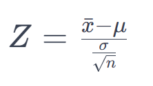
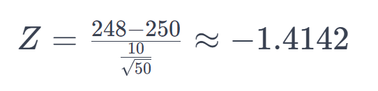

## Soru:
Bir konserve şirketi, konserve kutularındaki yemeklerin her
birinin ortalama olarak 250 gram olduğunu iddia ediyor. Siz,
denetçi olarak görev alıyorsunuz ve bu iddiayı test etmek
istiyorsunuz. Rastgele seçilen 50 konserve kutusundan numune
aldınız ve bu numunelerin ortalama ağırlığının 248 gram olduğunu
ve standart sapmasının 10 gram olduğunu buldunuz. Şimdi, α (alfa
düzeyi) değeri olarak 0.01 kullanarak, şirketin iddiasını reddetmek
için yeterli kanıtınızın olup olmadığını belirlemeye çalışıyorsunuz.
Yani, bu verilere dayanarak şirketin iddiasının doğru olup
olmadığını istatistiksel olarak değerlendirmeniz gerekiyor. Şirketin
verdiği iddia hakkında ne söyleyebilirsiniz?

## Cevap
Şirketin iddiasını istatistiksel olarak değerlendirmek için hipotez testi kullanabiliriz. İddia edilen ortalama ağırlık 250 gramdır. Bu nedenle, aşağıdaki hipotezleri kurabiliriz:

### H0 (Null Hipotezi):
Şirketin iddiası doğrudur, yani μ = 250 gramdır.
### H1 (Alternatif Hipotez):
Şirketin iddiası doğru değildir, yani μ ≠ 250 gramdır.

α (alfa düzeyi) değerini 0.01 olarak belirledik, bu da istatistiksel olarak anlamlı bir sonuç elde etmek için kabul edilebilir bir hata düzeyi seviyesidir.

Şimdi, verilerimize dayanarak hipotez testi yapabiliriz. Verilerimizden örneklem ortalama ağırlığı (x̄) 248 gram ve standart sapma (σ) 10 gram olarak bulunmuştur. Ayrıca, örneklem büyüklüğü (n) 50'dir.

Z istatistiği hesaplamak için aşağıdaki formülü kullanabiliriz:

```\[Z = \frac{{x̄ - μ}}{{\frac{{σ}}{{\sqrt{n}}}}}\]```



Burada:
- x̄: Örneklem ortalama ağırlık (248 gram)
- μ: Şirketin iddia ettiği ortalama ağırlık (250 gram)
- σ: Standart sapma (10 gram)
- n: Örneklem büyüklüğü (50)
- Z: Z istatistiği

Z istatistiği hesaplandığında, bu değeri standart normal dağılımın z-tablosu veya istatistiksel yazılımlar aracılığıyla α düzeyinde iki yönlü test için ele alabiliriz. α/2 düzeyindeki kabul reddi bölgelerini kontrol ederek, Z değerimizi karşılaştırabiliriz.

Önce Z değerini hesaplayalım:

```\[Z = \frac{{248 - 250}}{{\frac{{10}}{{\sqrt{50}}}}} \approx -1.4142\]```



Şimdi, Z değerini α/2 (0.01/2 = 0.005) düzeyindeki kritik Z değerleriyle karşılaştıralım. Tabloya veya istatistiksel yazılıma göre,

```Zα/2 = Z0.005 ≈ ±2.575```

olacaktır.

Hesapladığımız Z değeri (-1.4142), α/2 düzeyindeki kritik Z değerlerinin arasında yer aldığından, null hipotezi (H0) reddedemeyiz. Yani, bu verilere dayanarak şirketin iddiasını istatistiksel olarak reddedemeyiz. Bu nedenle, mevcut verilere göre, şirketin ortalama ağırlık iddiası (250 gram) kabul edilebilir görünmektedir.